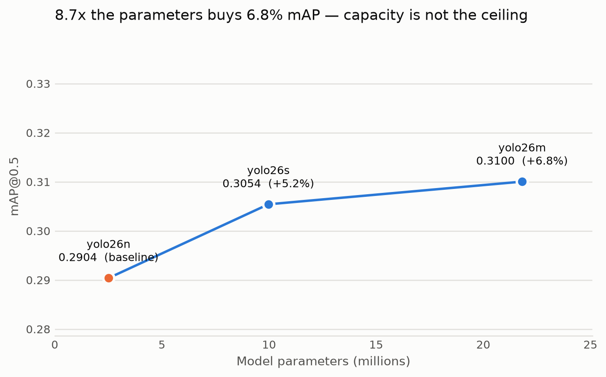

# Next Steps — Strengthening the Benchmark for Publication

This document recommends additional model implementations and experiments that would
make the research publication stand out, given the project's two constraints:

1. **Paper value** — a comparison that reviewers find complete and rigorous.
2. **Deployment** — every candidate should ideally export to **ExecuTorch (`.pte`)**
   so it can become a farmer-selectable option in the mobile app (like YOLO26 and the
   ViTDet backbone already do).

The current benchmark covers: **YOLO26n** (CNN one-stage), **Faster RCNN v2** (CNN
two-stage), **SE-FPN** (CNN two-stage + attention), a **7-config Faster RCNN ablation**,
**ViTDet** (ViT-B/16 transformer backbone + Faster RCNN head), **Swin** (hierarchical
transformer backbone + FPN + Faster RCNN head), and **RT-DETR** (transformer query head,
no NMS). The gaps below are ordered by impact-to-effort.

> **Status:** Tier-1 items 1 (RT-DETR, `src/rtdetr/`) and 2 (Swin, `src/swin/`) are now
> implemented. The remaining recommendations below are the next highest-value additions.

---

## [OK] DONE — YOLO26 capacity sweep (RTX 5090, 2026-08-04)

**Result: capacity is not the ceiling — the dataset is.** Full numbers, charts and
the reproducing script:
[`outputs/benchmarks/yolo_capacity_comparison.md`](../outputs/benchmarks/yolo_capacity_comparison.md)
· [`src/benchmark/yolo_capacity.py`](../src/benchmark/yolo_capacity.py)

| Model | Params | best.pt | mAP@0.5 | mAP@0.5:0.95 | Epochs | vs baseline | mAP/MB |
| ----- | ------ | ------- | ------- | ------------ | ------ | ----------- | ------ |
| **yolo26n** | 2.51M | 5.4 MB | 0.2904 | 0.1162 | 150/179 | baseline | **0.0538** |
| yolo26s | 9.97M | 20.4 MB | 0.3054 | 0.1208 | 116/120 | +5.2 % | 0.0150 |
| yolo26m | 21.81M | 44.1 MB | 0.3100 | 0.1218 | 83/88 | +6.8 % | 0.0070 |

**8.7× the parameters buys 6.8 % mAP@0.5**, and the curve flattens across the sweep
— n→s gains +5.2 %, s→m only a further +1.5 % for another 2.2× the parameters. Three
prior yolo26n runs had already plateaued at ~0.28 on a split holding roughly **124
training images per disease class**; this sweep confirms the limit is the data.

Two details that reinforce it:

- The larger variants converged in **fewer** epochs (88 and 120 vs 179) before early
  stopping — what you expect when a model saturates the available data rather than
  straining against its own capacity.
- Accuracy per megabyte falls **7.7×** from n to m.

### What this changes

1. **Collect more images.** This is now the highest-value work on the detector — more
   so than any architecture change. ~124 images/class is the binding constraint.
2. **Keep yolo26n for the mobile app.** Adding 39 MB for +0.02 mAP@0.5 is a poor trade
   in a rural-deployment context where install size is a real data cost.
3. **It is a citable negative result** — *"detector capacity is not the bottleneck at
   this dataset scale"* — backed by a clean 3-point sweep under identical data,
   schedule and augmentation.

> **Caveats for the write-up:** one run per variant, no seed repetitions, so the
> deltas are indicative rather than significance-tested. Batch sizes differed for
> memory reasons (32 / 48 / 32 for n / s / m), a mild confound since batch size
> affects final accuracy.

### Still open — batch size on the next box

The 5090 sat at **17–27 % utilisation** across these runs (12.5 GB of 31.4 GB for
yolo26s at batch 48). There is free wall-clock in a larger batch. **Re-measure on the
A5000 — it has 24 GB, less than the box these numbers came from** — and note that
changing batch between variants confounds a capacity comparison, so hold it constant
if you repeat the sweep.
---

## Tier 1 — highest impact for the paper

### 1. RT-DETR / DETR-style query head (transformer *detection paradigm*) — [OK] DONE (`src/rtdetr/`)
The ViTDet added here swaps the *backbone* but keeps the region-based (RPN + RoI) head.
A **query-based detector** (DETR / RT-DETR) removes anchors and NMS entirely — a
genuinely different detection paradigm. This gives the paper the full 2×2 story:
CNN-vs-Transformer **backbone** × region-vs-query **head**.

- **Why it stands out:** completes the architectural comparison; RT-DETR is SOTA-adjacent
  and real-time.
- **Mobile bonus:** DETR/RT-DETR **inference is static-shape** (fixed number of queries,
  no NMS, no dynamic proposals), so unlike the two-stage heads it can export as a
  **full end-to-end `.pte`** — arguably the *best* mobile candidate here.
- **Effort:** medium. RT-DETR is available via Ultralytics (`RTDETR`), so it can reuse the
  YOLO-style ExecuTorch export path already in `src/yolo/export_yolo.py`.

### 2. Swin Transformer backbone (hierarchical transformer + FPN) — [OK] DONE (`src/swin/`)
ViT-B is single-scale; **Swin** is hierarchical and produces a true multi-scale feature
pyramid, which usually beats plain ViT on detection (especially small lesions).

- **Why it stands out:** the standard "does a hierarchical transformer beat a plain ViT
  for dense prediction?" question, on an agricultural dataset.
- **Mobile:** backbone exports to `.pte` cleanly (static shapes); pairs with the same
  Faster RCNN head as ViTDet, so it drops into the existing harness.
- **Effort:** medium. `torchvision.models.swin_v2_t/s` + `_utils.IntermediateLayerGetter`
  + `FeaturePyramidNetwork`.

### 3. Mobile-first transformer backbone (MobileViT / EfficientViT / EfficientFormer)
ViT-B fp32 is ~340 MB — too large for a phone. A **mobile transformer** backbone gives an
honest on-device story and a realistic app model.

- **Why it stands out:** directly serves the deployment narrative; pairs naturally with
  the on-device latency table (see Tier 3).
- **Effort:** low–medium (via `timm`, which would be a new dependency — see note below).

---

## Tier 2 — rigor and completeness

### 4. INT8 / dynamic quantization for ExecuTorch — [WAIT] PARTLY DONE (`src/benchmark/quantize.py`, `latency.py`)
The ViT-B `.pte` backbone is ~348 MB fp32. **XNNPACK PT2E quantization** cuts this ~4×.

- **Built:** `src/benchmark/quantize.py` (PT2E static INT8 → XNNPACK `.pte`, with an
  automatic fp32-vs-int8 fidelity check) and `src/benchmark/latency.py` (size + CPU
  latency of every exported artifact).
- **Findings:** PTQ preserves accuracy on CNN backbones (ResNet: 100% top-1 agreement,
  ~3.8× smaller) but **collapses EfficientNet-B2** — the Stage-1 classifier needs **QAT**.
  Size shrinks ~4× everywhere; on Apple Silicon latency is roughly flat (INT8 CPU speedup
  shows on mid-range Android).
- **Remaining:** run `quantize.py` on the GPU server where the detector checkpoints live
  (ViT/Swin backbones), and add a **QAT** recipe for the EfficientNet classifier (or swap
  it for a quantization-friendly Stage-1 backbone).

### 5. Anchor-free head (FCOS / RetinaNet) on the ViT/Swin backbone
Adds a **one-stage** transformer-backbone point to complement the two-stage ViTDet — and
one-stage heads export to `.pte` more readily than two-stage RPN+RoI.

- **Effort:** low. `torchvision.models.detection.FCOS` / `RetinaNet` accept a custom backbone.

### 6. Statistical rigor
Reviewers increasingly expect this:
- **Multiple seeds** (≥3) per model → report mean ± std mAP, not a single run.
- **mAP@[.5:.95]** (COCO-style) in addition to VOC mAP@0.5.
- **Per-crop breakdown** (Corn / Pepper / Tomato) and significance testing (paired
  bootstrap or Wilcoxon) on per-image AP.
- The `src/benchmark/compare_models.py` aggregator is the natural place to compute these
  once each model writes its `final_eval.json`.

---

## Tier 3 — deployment & trust story

### 7. On-device latency & size table
Measure each exported model on the **M4 Pro** and a **mid-range Android** device: `.pte`
size, cold-start, per-image latency, peak memory. This is the table that justifies which
model actually ships to farmers — and pairs the accuracy benchmark with a cost axis.

### 8. Explainability for agronomic trust
**Attention rollout** (ViT/Swin) and **Grad-CAM / Eigen-CAM** (CNNs) over the same leaf
images make a compelling qualitative figure and address the "why did it predict this?"
question that matters for farmer adoption.

### 9. Knowledge distillation → tiny deployable student
Distill the best/heaviest model (SE-FPN or ViTDet) into a small mobile detector. Strong
"accuracy retained at a fraction of the size" result and a genuinely shippable artifact.

---

## Dependency note
The current code is **torchvision-only** (no `timm` / `transformers`). Items 1 (via
Ultralytics RT-DETR) and 2, 5 (via torchvision) add **no new heavy dependency**. Items 3
and some Swin/MobileViT variants would pull in `timm`; keep that opt-in and isolated to
its own `src/<model>/` package, consistent with how `src/vit/` is decoupled.

## Recommended order
1. ~~**RT-DETR**~~ — [OK] done (`src/rtdetr/`)
2. ~~**Swin backbone**~~ — [OK] done (`src/swin/`)
3. ~~**Quantization + latency tooling**~~ — [WAIT] tools done (`src/benchmark/quantize.py`,
   `latency.py`); run on the server + add a QAT recipe for the EfficientNet classifier
4. **Multi-seed + mAP@[.5:.95] + significance** (reviewer-proofing) ← next
5. **Attention/Grad-CAM explainability figure** (adoption story)
6. **Mobile-first transformer backbone** (MobileViT / EfficientViT) for a shippable model
